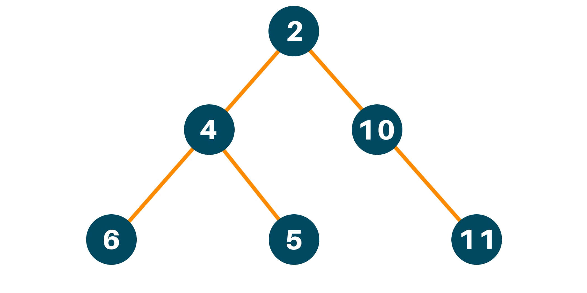

# Week 2 : Data Structures and Algorithms!

This week guys we will learn exactly what the course is about **Data Structures and Algorithms**! So without further a do lets go ahead and code some linear and non linear data structures today and along with them we will have to code **algorithms** to help us search through the data structure!

### Linked List

A linked list is one of the easiest data structures to understand and is fairly simple to implement.


It is consisted of nodes and the way nodes are connected to each other is by pointers. \*Note that pointers in C++ is different from pointers in data structures. Anyways lets examine the code to implement this data structure.

```c++
#include <iostream>
#include <array>
#include <string>

using namespace std;

namespace dsa
{
    template <typename T>
    class Node
    {
    public:
        // CLASS PROPERTIES
        T data;
        Node *next;

        // CONSTRUCTORS DEFAULT AND CUSTOM
        Node(){};
        Node(T x, Node *y) : data(x), next(y){};
        Node(T x) : data(x), next(NULL){};

        // CLASS FUNCTIONS
        void setNext(Node *next)
        {
            this->next = next;
        };

        Node getNext()
        {
            return this->next;
        }

        void setData(T data)
        {
            this->data = data;
        };

        T getData()
        {
            return this->data;
        };

        void printNode()
        {
            cout << "Node\nData: "
                 << this->data << "\nNext: "
                 << this->next << endl;
        }
    };

    template <typename T>
    class LinkedList
    {
    public:
        // CLASS PROPERTIES
        Node<T> *head;
        Node<T> *tail;
        int size;

        // DEFAULT CONSTRUCTOR
        LinkedList() : head(NULL), tail(NULL), size(0){};

        // CLASS FUNCTIONS
        void addToList(T data)
        {
            Node<T> *tempNode = new Node<T>(data);

            // WHEN LIST IS EMPTY
            if (size == 0)
            {
                this->head = tempNode;
                this->tail = tempNode;
                this->head->setNext(tail);
                this->tail->setNext(NULL);
                this->size++;
            }

            else
            {
                this->tail->next = tempNode;
                this->tail = tempNode;
            }
        };

        void printList()
        {
            auto traverser = this->head;
            cout << traverser->data << "   <HEAD>" << endl;
            while (traverser->next != NULL)
            {
                cout << traverser->next->data << endl;
                traverser = traverser->next;
            }
        };

        int getSize()
        {
            return this->size;
        }
    };
}

int main()
{
    // MAKING ARRAY OF DATA
    array<string, 4> myArr = {"I", "Am", "Linked", "List"};

    // MAKING LIST
    dsa::LinkedList<string> myList;

    // ADDING TO LIST
    for (string i : myArr)
    {
        myList.addToList(i);
    }

    myList.printList();
}
```

### Binary Tree

This is a heirarchical data structure that consists of Nodes and Pointers just like the Linked List! The cool thing is that traversing the Binary tree is not O(n) but instead it can more efficient and be O(log(n)).

In a Binary Tree a Node has a left and right pointer! Some rules to know is that the value of the left pointer will always be less than the parent and the value of the right pointer will always be greater than the parent.



Here is my implementation of Binary Tree.

```c++
#include <iostream>
#include <vector>

using namespace std;

// DECLARATIONS
namespace dsa
{
    template <typename T>
    class Node
    {
    public:
        // PROPERTIES
        T data;
        Node<T> *left;
        Node<T> *right;

        // CONSTRUCTOR
        Node() : data(NULL), left(NULL), right(NULL){};
        Node(T x) : data(x), left(NULL), right(NULL){};

        // CLASS FUNCTIONS
        T getData();
        void setData(T data);

        Node<T> getLeft();

        void setLeft(Node<T> left);

        Node<T> getRight();

        void setRight(Node<T> right);
    };

    template <typename T>
    class BinaryTree
    {
    public:
        // PROPERTIES
        Node<T> *root;
        vector<T> display;
        int size;

        // CONSTRUCTOR
        BinaryTree() : size(0){};

        // CLASS FUNCTIONS
        void addToTree(T data);
        void traverseTree(Node<T> *nodeToAdd, Node<T> *nodeToSearch);
        void getRightTree(Node<T> *nodeToSearch);
        void getLeftTree(Node<T> *nodeToSearch);
    };
};

// IMPLEMENTATIONS

template <typename T>
T dsa::Node<T>::getData()
{
    return this->data;
};

template <typename T>
void dsa::Node<T>::setData(T data)
{
    this->data = data;
};

template <typename T>
dsa::Node<T> dsa::Node<T>::getLeft()
{
    return this->left;
};

template <typename T>
void dsa::Node<T>::setLeft(dsa::Node<T> left)
{
    this->left = left;
};

template <typename T>
dsa::Node<T> dsa::Node<T>::getRight()
{
    return this->right;
};

template <typename T>
void dsa::Node<T>::setRight(dsa::Node<T> right)
{
    this->right = right;
};

template <typename T>
void dsa::BinaryTree<T>::traverseTree(dsa::Node<T> *nodeToAdd, dsa::Node<T> *startNode)
{
    if (nodeToAdd->data > startNode->data)
    {
        if (startNode->right == NULL)
        {
            startNode->right = nodeToAdd;
            return;
        }
        traverseTree(nodeToAdd, startNode->right);
    }
    if (nodeToAdd->data < startNode->data)
    {
        if (startNode->left == NULL)
        {
            startNode->left = nodeToAdd;
            return;
        }
        traverseTree(nodeToAdd, startNode->left);
    }
}

template <typename T>
void dsa::BinaryTree<T>::addToTree(T data)
{
    dsa::Node<T> *newNode = new dsa::Node<T>(data);

    // LIST IS EMPTY
    if (!this->root)
    {
        this->root = newNode;
        return;
    }
    // LIST ISNT EMPTY
    traverseTree(newNode, this->root);
}

template <typename T>
void dsa::BinaryTree<T>::getRightTree(dsa::Node<T> *nodetoSearch)
{
    this->display.push_back(nodetoSearch->data);
    while (nodetoSearch->data)
    {
        if (nodetoSearch->left->data && nodetoSearch->data != this->root->data)
        {
            if (nodetoSearch->right->data)
            {
                dsa::BinaryTree<T>::getLeftTree(nodetoSearch->left);
                this->display.push_back(nodetoSearch->right->data);
                this->size++;
            }
        };

        if (nodetoSearch->right->data)
        {
            this->display.push_back(nodetoSearch->right->data);
            this->size++;
        }

        nodetoSearch = nodetoSearch->right;
    };

    for (T i : this->display)
    {
        cout << i << endl;
    }
    this->size = 0;
}

template <typename T>
void dsa::BinaryTree<T>::getLeftTree(dsa::Node<T> *nodetoSearch)
{
    this->display.push_back(nodetoSearch->data);
    while (nodetoSearch->data)
    {
        if (nodetoSearch->right != NULL && nodetoSearch->data != this->root->data)
        {
            if (nodetoSearch->left != NULL)
            {
                dsa::BinaryTree<T>::getRightTree(nodetoSearch->right);
                this->display.push_back(nodetoSearch->left->data);
                this->size++;
            }
        };

        if (nodetoSearch->left != NULL)
        {
            this->display.push_back(nodetoSearch->left->data);
            this->size++;
        }
        nodetoSearch = nodetoSearch->left;
    };

    for (T i : display)
    {
        cout << i << endl;
    }

    this->size = 0;
}
```

---

### Agenda For Week 2

- References and Pointers

- Linked List

- Binary Tree

- Headerfiles
