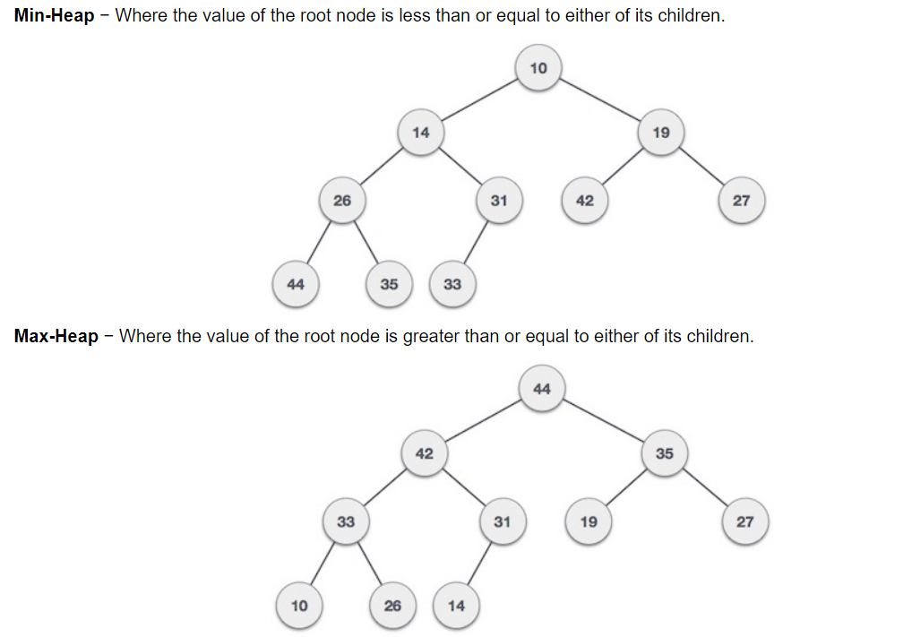
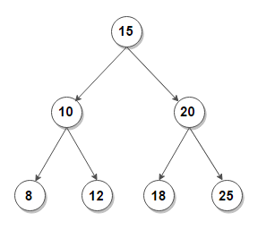

# Week 8 - Queues and Priority Queues!

We know the Queue is a FIFO linear data structure that is used commonly in every day life like a movie theatre line or your spotify queue. We actually have made a queue already and provided a header file that you guys can use for your future projects. Here is the code again.

```c++
#include <iostream>
#include <array>

// CONSTANT VARIABLE
#define MAX 100

namespace dsa // AVOIDING NAME COLLISIONS
{
    // DECLARATIONS
    template <typename T>
    class Queue
    {
    public:
        // PROPERTIES
        std::array<T, MAX> items;
        int size;
        int i; // iterator property

        // COSTRUCTOR
        Queue() : items(), size(0), i(0) {};

        // CLASS FUNCTIONS
        void enqueue(T item);
        T dequeue();
        void del(T item);
        void print();
    };
}

// IMPLEMENTATIONS
template <typename T>
void dsa::Queue<T>::enqueue(T item)
{
    // ACCESSING
    this->items[this->size] = item;
    // // INCREMENT
    ++this->size;
}

template <typename T>
T dsa::Queue<T>::dequeue()
{
    return this->items[this->i++];
}

template <typename T>
void dsa::Queue<T>::print()
{
    std::cout << "SIZE OF QUEUE: " << this->i << std::endl;
    int idx = 0;
    for (int x = this->i; x < this->size; x++)
    {
        std::cout << idx++ << ": " << this->items[x] << std::endl;
    }
}
template <typename T>
void dsa::Queue<T>::del(T item)
{
    dsa::Queue<int> tempQueue;

    for (int x = 0; x < this->size; x++)
    {
        if (this->items[x] != item)
        {
            tempQueue.enqueue(this->items[x]);
        }
    }

    this->items = tempQueue.items;
    this->size = tempQueue.size;
}
```

### Priority Queue

Alright so what we are going to do is learn how to make a Priority Queue! A PQ is a data structure very similar to a Queue however the FIFO rule goes out the window and instead follows a rule of dequeueing the element with the highest priority. Thus why it is called a Priority Queue.

A Priority Queue has two forms of priority and that is Ascending and Descending. Lets see an example in Ascending

- Ascending
    
    - 3 , 7 , 10 , 12 , 14 , 16
    
    - In this example 3 would be removed first since it has the highest priority.

- Descending

    - 20 , 17 , 15 , 12 , 10 , 7

    - In this example 20 would be popped first because in descending order 20 has the highest priority.

### How is Priority Queue Implemented

- Using an Array
- Linked List AKA Pointers
- Heaps  **\*Havent Discussed Yet\***
- Binary Search Tree  **\*Havent Discussed Yet\***

### Todays Class!
 
Alright so today we will be using an Array and a Linked List in order to implement a Priority Queue. 

### Array

```c++
#include <iostream>
#include <array>

// CONSTANTS
#define MAX 100

// DECLARATIONS
namespace dsa_array
{
    class PriorityQueue
    {
    public:
        // PROPERTIES
        std::array<int, MAX> items;
        int size;
        int i;

        // CONSTRUCTOR
        PriorityQueue() : items(), size(0), i(0){};

        // CLASS FUNCTIONS
        void enqueue(int element);
        int dequeue();
        void bubble_sort();
        void print();
    };
};

// IMPLEMENTATION
void dsa_array::PriorityQueue::enqueue(int element)
{
    this->items[this->size] = element;
    ++this->size;

    if (this->size > 1)
    {
        this->bubble_sort();
    }
};

void dsa_array::PriorityQueue::bubble_sort()
{
    // Variables
    int temp;

    // Sorting
    for (this->i; i < this->size; this->i++)
    {
        for (int j = i + 1; j < this->size; j++)
        {
            if (this->items[i] > this->items[j])
            {
                temp = this->items[i];
                this->items[i] = this->items[j];
                this->items[j] = temp;
            };
        };
    };

    this->i = 0;
};

int dsa_array::PriorityQueue::dequeue()
{
    return this->items[this->i++];
}

void dsa_array::PriorityQueue::print()
{
    for (int x = this->i; x < this->size; x++)
    {
        std::cout << this->items[x] << std::endl;
    }
}
```

### Linked List

```c++
#include <iostream>
#include <vector>

// CONSTANTS
#define MAX 100

// DECLARATIONS
namespace dsa_linkedlist
{
    class Node
    {
    public:
        // PROPERTIES
        int data;
        Node *next;

        // CONSTRUCTOR
        Node() : data(), next(NULL){};
        Node(int element) : data(element), next(NULL){};
    };

    class PriorityQueue
    {
    public:
        // PROPERTIES
        Node *head;
        Node *tail;
        int size;

        // CONSTRUCTOR
        PriorityQueue() : head(NULL), tail(NULL), size(0){};

        // CLASS FUNCTIONS
        void enqueue(int element);
        int dequeue();
        void bubble_sort();
        void print();
    };
};

// IMPLEMENTATION
void dsa_linkedlist::PriorityQueue::enqueue(int element)
{
    // CREATING NEW NODE
    dsa_linkedlist::Node *newNode = new dsa_linkedlist::Node(element);
    // CHECKING IF EMPTY
    if (this->size == 0)
    {
        this->head = newNode;
        this->tail = newNode;
        this->head->next = tail;
        this->size++;
        return;
    }

    // IF NOT EMPTY
    this->tail->next = newNode;
    this->tail = newNode;
    this->tail->next = NULL;
    this->size++;
    this->bubble_sort();
    return;
};

void dsa_linkedlist::PriorityQueue::bubble_sort()
{

    // Variables
    int temp;
    std::vector<int> sortingVector;
    dsa_linkedlist::Node *traverseNode = this->head;
    dsa_linkedlist::PriorityQueue tempPQ;

    // Clearing the Queue and Storing the Elements into a Vector
    while (traverseNode != NULL)
    {
        sortingVector.push_back(traverseNode->data);
        traverseNode = traverseNode->next;
    }

    // Sorting
    for (int i = 0; i < this->size; i++)
    {
        for (int j = i + 1; j < this->size; j++)
        {
            if (sortingVector[i] > sortingVector[j])
            {
                temp = sortingVector[i];
                sortingVector[i] = sortingVector[j];
                sortingVector[j] = temp;
            };
        };
    };

    // Recreating Linked List
    for (int i = 0; i < sortingVector.size(); i++)
    {
        if (i == 0)
        {
            dsa_linkedlist::Node *newNode = new dsa_linkedlist::Node(sortingVector[i]);
            this->head = newNode;
            this->tail = newNode;
            this->head->next = tail;
        }
        else
        {
            dsa_linkedlist::Node *newNode = new dsa_linkedlist::Node(sortingVector[i]);
            this->tail->next = newNode;
            this->tail = newNode;
        };
    };
};

int dsa_linkedlist::PriorityQueue::dequeue()
{
    dsa_linkedlist::Node *tempNode;
    tempNode = this->head;
    this->head = this->head->next;
    return tempNode->data;
}

void dsa_linkedlist::PriorityQueue::print()
{
    dsa_linkedlist::Node *traverseNode = this->head;

    while (traverseNode != NULL)
    {
        std::cout << traverseNode->data << std::endl;
        traverseNode = traverseNode->next;
    }
}
```

### Heaps

Heaps are made from a binary tree where the root is either the maximum or the minimum value in the data structure. There is a a Min-Heap and there is a Max-Heap. 

- In a Min-Heap the root node is less than or equal to either of it's children.

- Max-Heap is where the root node is greater than or equal to either of it's children.

We will construct these data structures when we go over binary trees and the understanding of heaps will be much more clearer.



### Binary Search Tree

A Binary Search Tree is a data structure that is made up of Nodes and Pointers just like a linked list however the data structure is **not** linear. Instead of thinking of the pointer being next in line think of a pointer being children of the Node. Expanding like a big family tree. Every node has a left child and a right child. If the node doesn;t have any childrnen it's referred to as a **leaf**.   



## Week 8 Recap Section!!

1) Why are headerfiles useful??

2) What is the difference between linear data structures and heirarchical data structures.

3) What methods have we covered to make a Stack/Queue

4) If we want to use Binary Search what condition has to be met?

5) What are the steps for a successful recursive function?

6) What Big O notation is associated with Recursive Algorithms?

7) When is recursion better than linear?

8) Why do we use templates ie. Why do we templatize functions?

9) What are some main concepts of OOP?

10) What data structures will you use in your projects??

### Assignment Time!! 

- Make a Linear Data Structure with pointers or array (your choice) and make sure it works and can accept many elements. 

- Then with the elements inserted into the Data Structure, make sure to perform Binary Search on the dataset. ( Make sure to sort beforehand!!)

- The sorting can be done with the bubble sort algorithm or you can use another sorting algorithm.

Due for next session on April 27th! Will give most of class time to do it :D 


